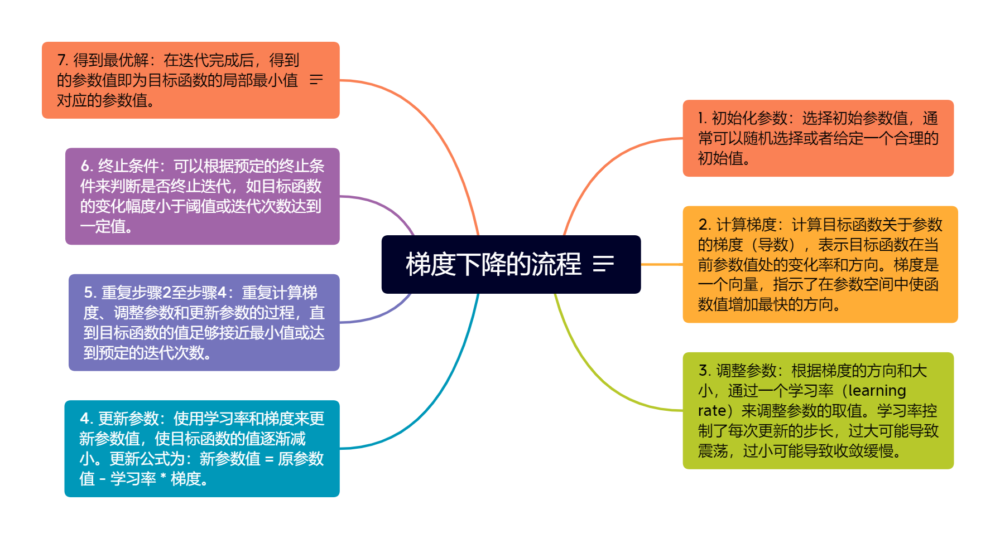

# go-machine-learn

基于golang的机器学习仓库，因为python有GIL，动态语言，不易多人维护，性能较差；golang原生支持并发，易维护，上手容易，性能强，希望提供性能
更强的机器学习，同时易上手。

app目录里是各种机器学习相关的算法实现,例如：
[gradient_descent.go](https://github.com/KuanFate/go-machine-learn/blob/main/app/gradient_descent.go)

docs目录是用思维导图画的算法的实现原理 例如：
